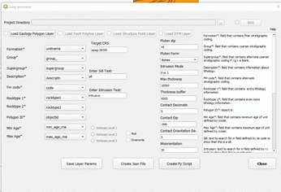

# Welcome to qgis-loopplugin's plugin overview!
============================================

## Why loopplugin?

This plugin let you select your raster and/or vector datasets in your local directory. Once, the user select their file,
the various shapefile and raster files are then automatically filter to create both a output json file and python script that is used as input for Map2Loop (Loop project).

## How to install **loopplugin**?

   You can git clone this plugin from the Loop3D repository. [https://github.com/Loop3D/qgis-loopplugin](https://github.com/Loop3D/qgis-loopplugin)

## How to run **loopplugin**?

A usage example can be seen below:

Launching the plugin:*

<p align="center">
  
</p>

### Set the project path

- Select the Project Directory:
   * Click the tool button (...) at the end of the QLineEdit widget.
   * Navigate between directories and select your project folder
   * Then, click Select Folder into the pop up window
   * Finally, the project directory is printed into the QLineEdit.

### Load geology Layer into qgis workspace

- Click into (Load Geology Polygon Layer) to load the geology shapefile
- Once loaded, automatically the multiple combobox will be filled with Layer columns names.
-  ```diff Check that the filled values are correctly selected in the combobox.```
- Also a text label appear on top of QLineEditor for example for the top one, Enter sill text, 
  while the botton will show (Enter intrusion text). In these QLineEditor, default values are printed out, i.e sill=sill. However, you can delete those values and input your own.

- For example:
   * Rocktype 1* --------> rocktype1 
   * Min Age*    --------> min_age_ma

- After every combobox selected, the user click (Save Layer Params) to save their geology  
  parameters.
- Once (Save layer Params) is clicked, individual parameter in the combobox is saved and this is 
	confirmed by the (Tick) button being selected.

 An example can be seen below:

 Automated results after the geology layer is loaded:*

<p align="center">

</p>

### Repeat the process for Fault Polyline, Structure Point and DTM Layers

- Same process as the above.
- For DTM only select the layer which in return will provide the filepath needed in the py script.
- No need to click (Save Layer Params) for this layer. 

### Loading Fold Polyline and Min Deposit Point Layer

- Hard coded for now..

### Create json and/or Py script

- After the above is completed, then:  
   * Click "Create Json File" to generate a "data.json" in your Project Directory.
   * Click "Create Py Script" to generate a "Run_test.py" in your Project Directory.

* From this point, the final output are data.json and Run_test.py available in your project directory can be used as input to Map2loop/LoopStructural software.

### Future releases:

  *ROI = Region of interest.. A polygon cliping tool which will be used to crop data and save it as a new layer.
  
  *Layer selection from Qgis frame and/or database (not shown in plugin image).

  *Verbose 1,2,3 

  *Map2loop/LoopStructural loader To run Map2Loop using the generated json and py scripts.

